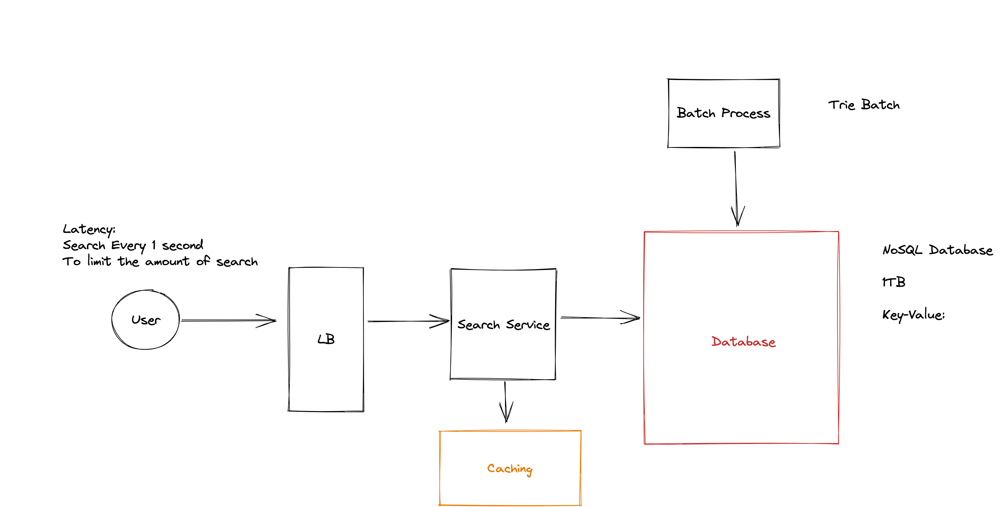

This editor is synced in real time with your peer.

Use it to share thoughts and resources, such as:
- Features scope
- API design
- Pseudo code for specific components
- Data model/schema
- Back-of-the-envelope calculations
- Reference links
- Link to whiteboard or diagram such as https://sketchboard.me/new

Good luck!

# Typeahead

## Design Typeahead

Functional Requirements:

1. A user should type letter in the search box
   - The system should return 10 suggestions of search
   - The order is based on popularity

Live Popularity - Daily Update -
No Histical Results - 

1B DAU
10 search per day

Non-Functional Requirements:

1. Scalability
2. Availability
3. Fault Taulerance
4. Latency Fast Results 200 MS?
5. Performance 

Back of Enveloppe Estimations
API Design
Schema Design
System Design

Estimate the number of words:
10 letters per search
26^10

1B unique Terms

1term = 3 words = 1 word * 5 average = 17 letters average

30 Bytes per word average

30byets * 1B. = 30GB

100 characters typeahead suggestion

Storage Suggestion

key: Term
Value: List of Suggestion

30B
1B * 10* 100 Bytes = 1TB

/search
term: string

result:
list of suggestions

Storage Count
key: Word
Value: Count of Search Yesterday
Number of days ago

abcd
abc
abc
abab
ab
ab
ab
add
aeee

a: ab (3)
ab: ab (3)
abc: abc (2)

Trie: Limit Storage
Keep the Trie in Memory

LRU 

