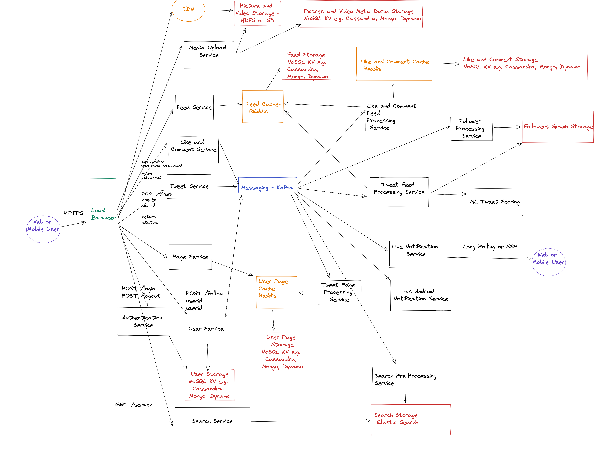

# Twitter System Design

## Functional Requirements

Scope, Priority

1. A user should be able to post tweets
   - A tweet can be 124 characters long
   - A tweet can attach a picture
   - A tweet can attacha video
2. A user should be able to retweet
3. A user should be able to Like, Comment on a tweet and share a tweet

4. A user should have access to a feed.
   - The feed can be ordered by latest
   - The feed can be ordered by most relevant
   
5. A user should be notified when a tweet is received

6. A user should be notified when the feed has new content

7. A user should be able to search other users, tweets

8. A user should be able to receive notifications

9. A user should be able to follow other users.

10. Any user can access another users Page and see the latest Tweets, Replies, Likes for that user.

11. A user should be able to change their setting. (name, bio description, picture...)

12. A user should be able to send private message and receive private message

Priority
1-10
message12, settings11

Users: 1B
Average post per day: 5 post per day per user
(User with more or less)
Average news feed lookup: 5 times per day per user

## Non-Functional Requirements:
1. Scalability
2. Availability (Up 99.999 9.9999. 1 minute per year down)
3. Fault-Tolerant
4. Performant (Fast)
5. Cost??

## Back of the Envelope Estiamtions

Users 1B
-userid
-username
-bio description
...

Tweets
-tweetid
-content
-resource
-resoruceType(IMAGE,PICTURE,LINK)

Followers (Graph DB... Distributed Graph)
-followeruserid
-followeduserid

Notification
-userid
-message

Feed
-userid
-listofposts
-creationdate
-status (NEW, PARTIALY_READ, FULLY_READ)

1B * ~1000 Characters * 4 Bytes = 4TB for user

1B * 5 * 200 Characters = 1TB per day of new Tweets

Followers ... TB

Each user has 100 followers... = 1B * 100 * 100 Characters * 4 Bytes = 40TB per day 

(possibly a smaller message)

https://excalidraw.com/#room=091568d066429fb3ec86,aBjTYNhjpOhC4eF62_7bCg

## References: 

-Grokking the System Design - Design Gurus

-System Design Interview - Alex Xu

-Designing Data Intensive Applications-   Martin Kleppmann

-Funamentals of Software Architecture - Neil Ford, Mark Richards

-Software Architecture the Hard Parts - Neil Ford, Mark Richards

-System Design Primer - https://github.com/donnemartin/system-design-primer

-Blog Article https://medium.com/geekculture/cracking-the-system-design-interview-theory-basics-c57f5326181b

-Youtube
 - Gaurav Sen https://www.youtube.com/@gkcs
 - System Design Interview https://www.youtube.com/@SystemDesignInterview
 - Exponent https://www.youtube.com/@tryexponent
 - Tech Dummies with Narandra https://www.youtube.com/@TechDummiesNarendraL
 - ByteByteGo https://www.youtube.com/@ByteByteGo