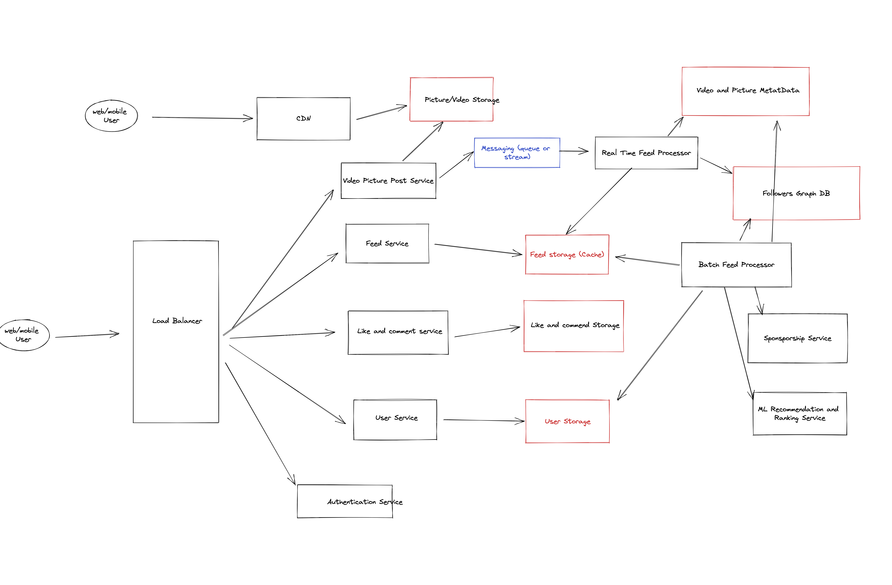

# Design Instagram:

## Design

## Functional Requirements:

1. User should be able to access the app on Mobile and Website
2. Only English
3. User should be able to access a feed of pictures
    a. User should see pictures from the pages followed
    b. There should be extra recommended or spondered posts

4. Order of the posts. Assume sported by time (latest)
5. User should be able to post pictures or videos

6. user should be able to like and comment
7. Search 

How many users?
Scale to 500M users

Post once a day on average.
60 million pictures posted per day
35 million videos uploaded per day

Reading 20 requests per day

Some accounts are going to be large and some small

On premise

## Non-Functional Requirements:

1. Scalability
2. Availability and Fault Tolerance  99.9999 
3. Elasticity and performance

Latency - Performance. 

Consistency - Eventual 1 hour consistency

## Back of the Envelope Estimations:

Data Design

1 picture. 
10kb
1 video.
1mb

60M * 10kb = 10gb * 60 = 600 GB per day  pictures
35M * 1mb = 35 TB per day of videos

20 request per day per user:

20 * 500M = 10B content per day 

100KB * 10B per day / 10 ^5 = 100Kb * 1M = 100GB per second

## Data Storage

Users
- id
- name
- description

Followers
- followerid
- followedid

Video
-id
-desctition
-size
-date

Picture
-id
-desctition
-size
-date

Feed Data (Cache)
- user id
- List of posts

Comments 
- id
- contentid
- userid
- comment_text
- time

Likes
- id
- contentid
- userid
- time

1. 
POST /uploadVideo
VideoId
VideDesctiption

if Success

2. POST /uploadVideoData
BINARY OF THE VIDEO
Response

Tell the user if success or failure

https://excalidraw.com/#room=7df977a70821966fce9d,GMBCEhLebt5SLCR-OlVqFg

Latency Steam processor... tight processing...
