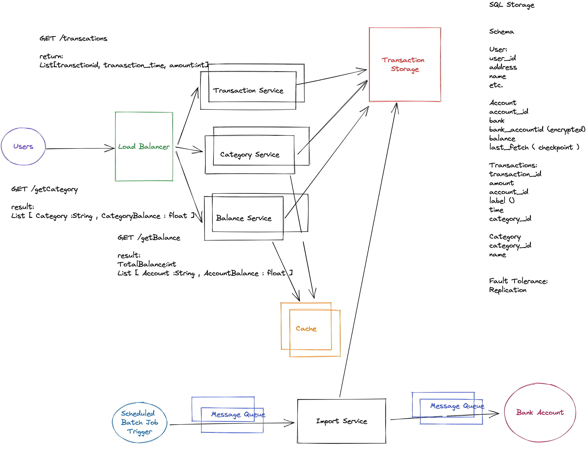

# Mint Design

Mint.com is a free, web-based personal financial management service, that allows its users to integrate with financial accounts to automatically extract their data, and manage their personal budget.

Design a system like Mint.

## Design

## Requirements:

- A user should be able to access their personal finance accounts transactions
- A user should connect with multiple bank accounts
- A user should be have a dashboard:
  - Total balance
  - Spending
  - Spending per category ( Gas, mortgage, food, etc.)

- Optional: see every individual transaction

Users: 10M
Each User: 10 bank account average
Each User has 10 transaction per day on average

## Non-Functional Requirements
- Scale to 10M
- Performance/Latency
- Security
- Accuracy
- Availability/ Fault Tolerance

https://excalidraw.com/#room=0138672dedcb8e2a9075,fDkDF3w88ldQ0FqZ1vitaQ

