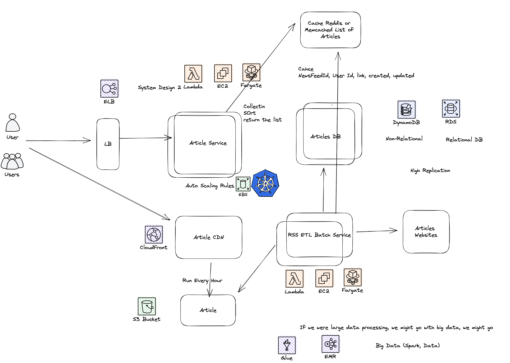

# Youtube Design 

 

## Features scope:

+ Users can browse and search for news articles from a variety of sources
+ Users can customize their news feed by selecting topics of interest and sources
+ Users can save articles for later reading or sharing
+ Users can view recommendations for related articles based on their reading history and + preferences
+ Users can view a personalized home page with the latest articles and updates from their selected sources and topics

## Functional Requirements:

+ The system should allow users to browse and search for news articles from a variety of sources
+ The system should allow users to customize their news feed by selecting topics of interest and sources
+ The system should allow users to save articles for later reading or sharing
+ The system should provide recommendations for related articles based on a user's reading history and preferences
+ The system should display a personalized home page with the latest articles and updates from a user's selected sources and topics

## Non-Functional Requirements:

+ The system should have high availability and uptime
+ The system should be able to handle a large number of users and news articles
+ The system should be able to provide personalized recommendations and updates in real-time
+ The system should be secure and protect user data privacy


## API Design

GET /articles

Query Parameters:
- q (optional): search query
- sources (optional): comma-separated list of source IDs to filter by
- topics (optional): comma-separated list of topic IDs to filter by
- page (optional): page number for pagination

```
Response:
{
  "articles": [
    {
      "id": 1,
      "title": "Article 1",
      "summary": "This is a summary of article 1",
      "url": "http://example.com/article1",
      "published_at": "2022-01-01T12:00:00Z",
      "source": {
        "id": 1,
        "name": "News Source 1"
      },
      "topics": [
        {
          "id": 1,
          "name": "Topic 1"
        },
        {
          "id": 2,
          "name": "Topic 2"
        }
      ]
    },
    {
      "id": 2,
      "title": "Article 2",
      "summary": "This is a summary of article 2",
      "url": "http://example.com/article2",
      "published_at": "2022-01-02T12:00:00Z",
      "source": {
        "id": 2,
        "name": "News Source 2"
      },
      "topics": [
        {
          "id": 3,
          "name": "Topic 3"
        }
      ]
    }
  ],
  "pagination": {
    "total_pages": 10,
    "current_page": 1
  }
}
```

```
GET /articles/<article_id>

Response:
{
  "article": {
    "id": 1,
    "title": "Article 1",
    "body": "This is the full body of article 1...",
    "url": "http://example.com/article1",
    "published_at": "2022-01-01T12:00:00Z",
    "source": {
      "id": 1,
      "name": "News Source
```


## Back-of-the-envelope calculations:

Assuming a news feed with 1 million sources and 10 million articles, the system would need to store and manage 10 billion article-source relationships.

If we store each relationship as a foreign key in the articles table, we would need approximately 4 bytes per relationship, for a total of 40 GB of storage.

If we assume that each article requires 1 MB of storage, we would need an additional 10 TB of storage for the articles themselves.

If we assume that each recommendation and update calculation takes an average of 100ms to complete, we would need a system with at least 10,000 queries per second (QPS) capacity to handle peak traffic.

To scale the system to handle more sources and articles, we may need to consider a distributed database or a distributed storage system. We could also consider implementing a cache to store the results of frequently-requested articles and recommendations in order to reduce the load on the database and improve performance.

Additionally, we may want to consider adding other features to the system such as the ability for users to customize the appearance of their news feed, the ability to view articles from a specific source or topic in a dedicated view, and the ability to receive notifications for breaking news or updates from specific sources.

We should also carefully consider the security of the system, including protecting against unauthorized access to user data and ensuring that user privacy is respected. This may involve implementing measures such as secure authentication and authorization, encryption of sensitive data, and compliance with relevant regulations and laws.

