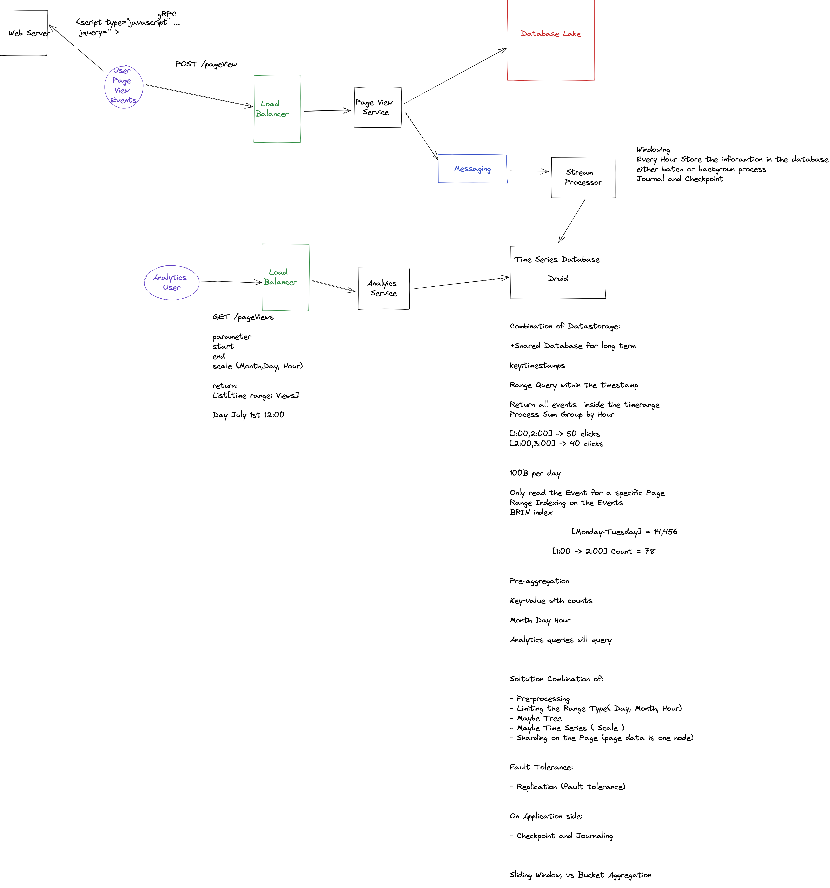

# Analytics

Design the functionality of an analytics system like Google Analytics.

## Functional Requirements:

- Analytics users
- Page Viewers

- Analytics Users want a dashboard with the Analytics Data
- We want to record the Page Viewers Data

(Location, Type of Device, Time, Pages Views)

Page Views Events Count historical Dashboard

(Google Tags (Special Evenets))

(Timeseries Database)

Total Page Views Per day: 100B
Analytics Users: 10,000

Non-Functional Requirements

1. Scalability
2. Accuracy 
3. Fault Tolerant/Available

Latency: 30 sec max

Estimations
Schema
API
Diagram Design

https://www.youtube.com/watch?v=0iyLURrWIgQ

