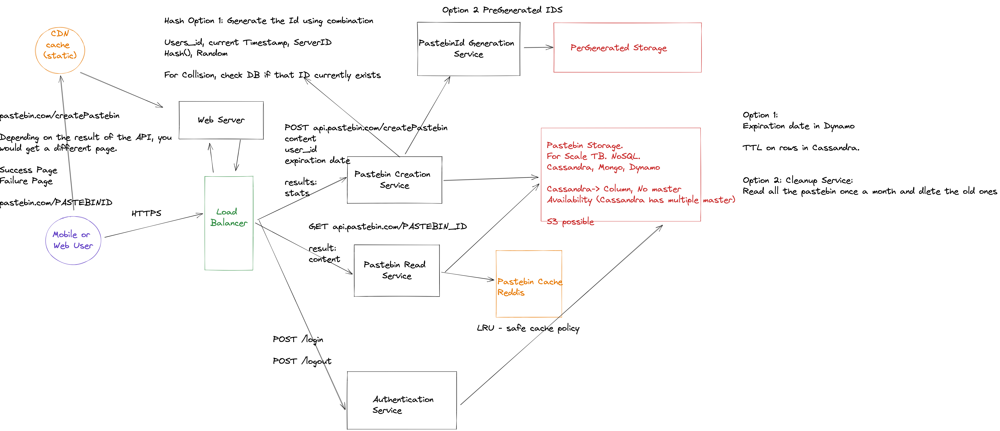

# Pastebin Design

## Design

# Functional Requirements

1. As a user I should be able to create a Pastebin
2. As a user I should be able to share the Pastebin with a unique URL
3. Once the pastebin is created, it cannot be modified
4. As a user I should be able to login
5. No password to the pastebin
6. How long is it going to stay up on the website? 90 days.
User should be able to set a custom time on the pastebin

https://www.geeksforgeeks.org/time-to-live-ttl-for-a-column-in-cassandra/

7. All the content in pastebin is Text only.
8. Is there a character limit? Maximum words is 1000 words.

9. How many users are create a pastebin every day?

10. The URL link should be of uniform length. 10 Characters.

0-9 + a-z + A-Z = 26+26+10 = 62.    62^10 = 10^17

Is it going to change over time?

DAU (Daily active users): 1M

1 pastebin per user per day?

How many pastebin are read every day?

10M 

P0
1. As a user I 
2. No search
3. No Payment

## Non-Functional Requirements:

1. Scalability
2. Availability & Tolerance
3. Performance / Latency 

## Estimations:

1. How much storage total?
2. How many request per second? create and read

1M Users

### Users:
- user_id (pk) 
- user_name
- email_address
- password (hashed)
- creation_date

### Pastebin
- pastebin_id (pk)
- content (1000 words) 
- password (optional)
- creation_date
- user_id (creator)

Average:
Assumption: 
1 word = 10 letters
10,000 characters

Max limit for DB column:
10,000 characters LIMIT

Unlimited size High limit

K/V database (mongdb K = pastebin)

One relation DB

Total Users:

1M * ( 4 + 4*20 + 50 *4+ 50*4 + 4 )bytes = 500bytes * 1M = 500MB Users

Pastebin created every day: 1M * ( 4+ 10,000 * 4 + 50*4 + 4 ) = 1M * 40,000 = 40GB created every day

14TB per year created

400GB read every day

140TB per year read

TB

NoSQL Distributed, Paritioned.

10M read requests per day = 100 QPS read

1M write requests per day = 10 QPS writes

https://excalidraw.com/#room=86afcf3b42622879ef90,Ar4qQJmTo5WMf4LgEIX8-Q
