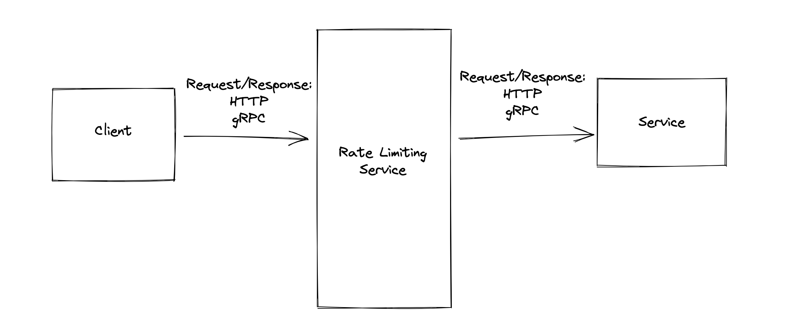

# Rate Limiting Service

# Design

## Requirements

1. A user should only be able to send a limited amout of request to the service.

2. After the limit has been reached, the reqest should return an error.

3. The user should know the current total traffic and available traffic.

Token Bucket (total token)

Leaking Bucket (token with a queue)

Tumbling Window (Fixed Window. From 1:00 to 2:00) 

Sliding Window (Last 1 hour)

User: Request per Second: 100 qps

API Services: 100s

## Non-Functional Requirements:
- Fault Tolerance / Availability
- Security

### Token Bucket (total token)

Counter for Tokens
Decrement the counter everytime you receive a request
Inrement the counter everytime you send back a response

### Leaking Bucket (token with a queue)

Counter for Tokens
Decrement the counter everytime you receive a request
Send the request to a Queue
Inrement the counter everytime you send back a response

Queue asks as backpressure

Queue only has 100, but 200. Then it will return a Rate Limit Error.

### Tumbling Window

Timer. e.g. every hour. Reset the Tokens counter.
It the counter reaches the hourly limit, then you return a rate limit Error.

### Sliding Window

Queue Log of Requests.
Keep remvoing logs older than the limit ( e.g. greater than one hour)
If the size of the queue log > Hourly Limit then you return a rate limit Error.

## Use Cases

#### Server Limitation. 
  Leaking Bucket. Backpressure.

#### CostCalculation(e.g. cloud service)
  Tumbling Window. Limit of usage per hour. If you reach the limit. Pay extra. Upgrade.
  (sliding window)

#### Ratelimiting based on SLA. (client service agreement)
  Tumbling Window or Tumbling

#### DDOS, Secruity
  Token Bucket. Counter
  10,000
  efficent

Use the RateLimiting Service.

e.g. NGNX server. Add extra inforamtion in the HTTP or RPC to pass to the client.

Current Usage.
Avaiable Usage.

Return the Rate Limiting Error message as well.

-AWS Account
-RateLimingServices
  -Configuration for API enpoints
    - 1 endpoint with 2000 request per hour
    - 1 endpoint with 3000 request per hour

Routing (HTTP Endpoint /) where each endpoint has a sliding window amount read from the memory cache.
Stored in a DB.

## DB Schema

AWSAccount
-account_id (pk)
...

RateLimitingServices
-rate_limiting_id (pk)
-type(Token Bucket, Sliding Window, Tumbling Window, Leaking Bucket)
-account_id (fk)
...

EndpointConfiguration
-endpoint_id (pk)
-rate_limiting_id (fk)
-URL_endpoint
-limit (40)
-timescale (HOURS, MINUTE, DAYS etc.) 
...

SQL database (postgres, mysql, oracle)

1. Security:

2. Fault-Tolerance:

- Multiple RateLimiting Servers
- Checkpoint (hourly, daily) store on disk. Current information.
- Replication of the SQL database

3. High Scalability:

- Multiple Ratelimiter Servers (nodes)
- Load Balancing
    
    - Network LB
    - API Gateway loadblancing
    - Application LB

    - API Gateway loadblancing in front of the Rate Limiters
    
      e.g.   API starts with /service1 -> Rate Limiter service 1 (max 100 endpoints) multiple Nodes
      - Round Robin
      - Random LB
      - Based on Volume of Node
      
      Distributed: Distributed algorithm to have distributed consistency
      -> 2PC
      -> Gossip

      e.g.   API starts with /service2 -> Rate Limiter service 2 (max 100 endpoints)

Keep the rate limiting data in memory with checkpoints

Customizability of the URL enpoints

