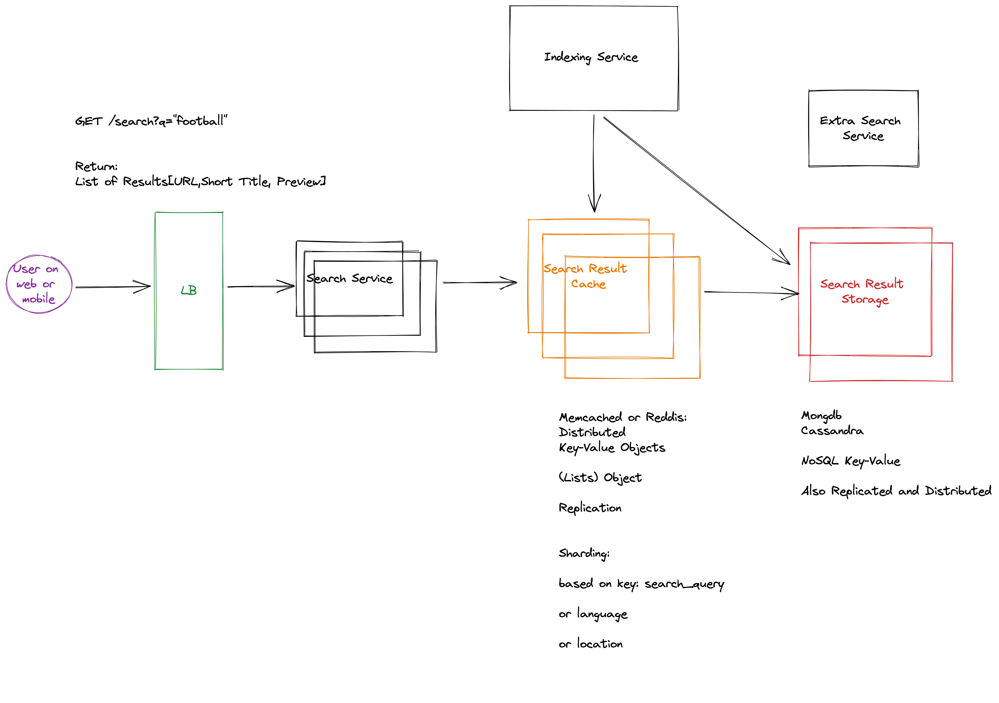

# Key-Value Cache for Search Engine

Design a key-value cache to save the results of the most recent web server queries, including a snippet about the search results itself.

In case you’re not already familiar, a cache system is a widely adopted technique that is used in nearly every application today and applies to every layer of the technology stack. A cache system stores commonly used resources, for example in-memory, and the next time a request is made for the same resource, the system can return it immediately.

## Design

## Feature Scope / Functional Requirements:

1. A user should be able to make search queries
2. We want to store the results of the recent Queries in a cache

## Out of Scope:
1. Search Autocomplete
2. Search Indexing
3. Search Ordering / Ranking

### What type of ranking for the cache?
- Most popular (highest traffic and clicks)
- Most Backlinks (Other pages pointing to this page)
- Customization for User Location / User Preferences

10M Users

10B Queries per month

(each user does 1000 queries per month)

How many pages? 10B pages on the pages?

## Non-Functional Requirements
1. Scalability (traffic and storage)
2. Availability (system to stay available)
3. Performance (latencty should be low ~ 100MS )

## Estimations

10B queries per month = 300M queries per day ~= 1000QPS

1KB average per page?

Storage = 10B pages * 1KB = 1TB storage

## Data

### SearchResult Table

+ id (pk)
+ searchTerm  (e.g. "football")
+ List[Result]

### Result
+ url
+ pagePreview
+ score (optional)
+ Title

## What type of caching should we use?

- Distributed Cache 

- Keep the most popular search queries in the cache
LRU

Design Diagram

https://excalidraw.com/#room=7f386e8a170ea45843c3,E218Hwn8Ph1D4aDJvJDi0w

Caching Techniques
- Cache Policy
	- LRU
	- Random
	- LFU
	- MRU
	- LIFO
	- FIFO

- Distributed 
	- Sharded 
	- Replicated 
- Embedded

- Multi Thread vs single Thread
- Type of Write
	- write through cache
	- write back cache
  - write asside

Design Diagram

Data Schema X

API Design X

Summary

Hey! Meki. You still here? I think you're disconnected.

