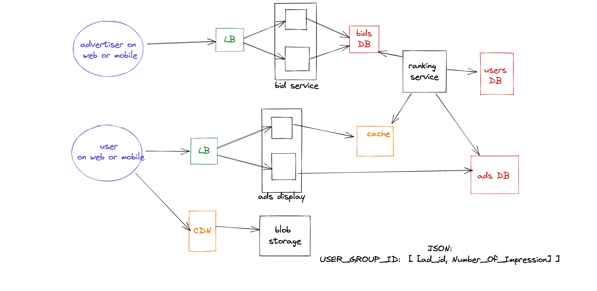

# Serving Advertising

## Design

## Functional requirements:
1. The advertising platform should allow users to view advertisements.
2. The platform should allow advertisers to create and manage campaigns to display their advertisements to users.
3. The platform should track user interactions with advertisements (e.g., clicks, impressions) and provide analytics to advertisers.
4. The platform should support real-time bidding for ad placements.
5. The platform should support targeting advertisements to specific users or groups of users based on demographics, interests, and other factors.

## Non-functional requirements:

1. The platform should be able to handle at least 100,000 queries per second (QPS).
2. The platform should have low latency, with ad delivery and real-time bidding processes taking no more than a few hundred milliseconds.
3. The platform should be highly available, with uptime of at least 99.99%.
4. The platform should be secure, with appropriate measures in place to protect user and advertiser data.
   
## Back of envelope estimation:
1. To support 100 million users, the platform will likely need to store and process a significant amount of data, potentially on the order of several terabytes.
2. The platform will need to be designed to scale horizontally, with the ability to add additional servers as needed to meet demand.
3. The platform will need to make use of caching and other performance optimization techniques to achieve the required QPS and latency targets.

## API design:

1. The platform should expose APIs for creating and managing campaigns, tracking ad impressions and clicks, and performing real-time bidding.
2. The APIs should support authentication and authorization to ensure that only authorized advertisers can access and modify their campaigns.
3. The APIs should be designed to be easy to use and well-documented, with clear error handling and validation.

## Schema design:

1. The platform will need to store information about users, advertisers, and campaigns in a database.
2. The schema should support efficient querying and aggregation of data for analytics purposes.
3. The schema should be designed to scale horizontally and support sharding if necessary.

## High-level component diagram:

1. The platform will likely consist of multiple layers, including a front-end layer for serving ads to users, a middle layer for managing campaigns and handling real-time bidding, and a back-end layer for storing and processing data.
2. The front-end layer may consist of a load balancer, a cache, and one or more web servers.
3. The middle layer may consist of one or more application servers running the ad management and real-time bidding logic.
4. The back-end layer may consist of a database cluster and possibly additional servers for data processing and analytics.
Note that this is just a high-level overview, and the specific design of the platform will depend on the specific requirements and constraints of the project.

