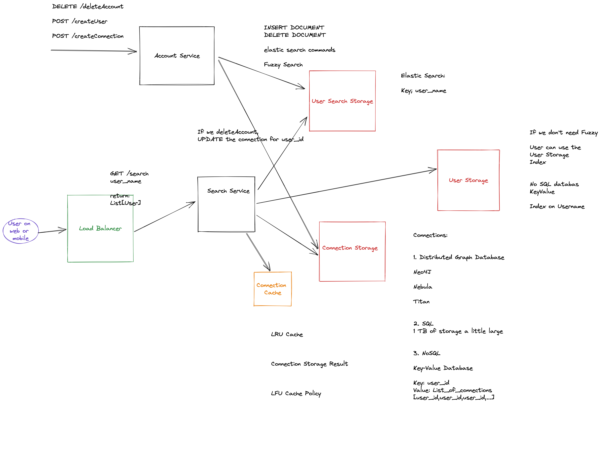

This editor is synced in real time with your peer.

Use it to share thoughts and resources, such as:
- Features scope
- API design
- Pseudo code for specific components
- Data model/schema
- Back-of-the-envelope calculations
- Reference links
- Link to whiteboard or diagram such as https://sketchboard.me/new

Good luck!

40 minutes - each
5-10 mins feedback

Social Network (Instagram, Facebook, LinkedIn )

Functional Requirements:

1. A user should be able to search for another user
   1. Every Users profile is searchable
   2. Search with Filter (Out of scope)
       1. Search City
       2. Job Title
       
       
5. Search result will have
    - Name of User
    - User id

2. We want to the shortest number of connections between uers on the search result
  1. The user should see the shortest path number only

3. Show Friends in common (out of scope)

4. Messaging, Timeline, User Pictures

5. Order of the search results
People with lower distance first

6. No Fuzzy search. Only exact search.
(later)

Users: 1B users

Number of search  QPS: 2.5M QPMonth

Average user has 50 connections?

Non-Functional Requirments:

1. Scalability
2. Availability / Fault Tolerant
3. Performance / Latency ( 300MS search time  P99 99% )

1B 

Data Schema

Users
-user_id (pk)
-username_
-DOB
...

Connection
-user_id (pk) (fk)
-user_id (pk) (fk)
-information

Data

NO back of envelope

500 Bytes user * 1B = 500GB

https://excalidraw.com/#room=d9e24dc848e8b746c386,VWqDwDO0J3bTtqTH4dHmRg

50* 1B users * 200 bytes = 1TB of storage

Connections:

1-> [2,4,5,6]
5-> [2,4]
6-> [2,4]

1 distance
2 distance
3 +

1000 connections max to limit

3+

"Barack Obama"

BFS Algorithm
Start the user 

add start user to the queue

distance = 0

Queue:
   
   for i in size of the queue:
    pop from the queue
    
    if you find the user:
        return the distance
    
    add the connections to the queue
   
   distance ++
   
   if distance >3:
      return

Should I do back of enveloppe estimation?

50 connections

1st degree 50

2nd 50 * 50 = 2500

3rd dregree 50 * 50 * 50 = 125,000

OPtimizaion for Social Search:

1Caching

2Start with the friends with higher number of connections

3Parallel BFS

4Graph Storage would be faster

5Use the Location

Sharding SQL also possible

ES

Distributed
Partitioned

Index Key-Value Storage

DOCUMENTS insert in elastic
(document propert1 property2)

proerty1(name):"Billy Joe Obama"prperty2:locaiton("USA,Virginia")
"Billy"

Key = Billy -> doc1, doc2

Joe -> doc1

Obamab -> doc1

Special optimization for fuzzy search

Tokenization is Customizable

Master slave

Index PK

Create your own index

20 mins on requirements:

Explain the Cache more

Like Template

Protocols

Communication Protocols

(HTTP / gRPC)

Split the Search service:
User Finding
Connection Finding

Why not SQL ?

Should I do back of enveloppe estimation?

Designt he schema later

Data Schema