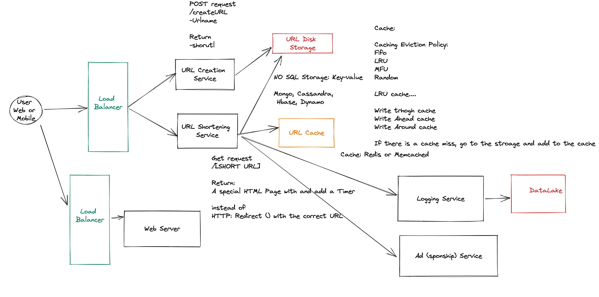

# Design a URL Shortner

## Functional Requirements:
- A user should provide a URL and receive a shoreded url
- A user should be redirected to the original URL when going to the shoretened URL

- Timelimit on the short? URL valid for a configurable amount of time

- How many short urls created per day?

- Before redirecting the user should see a 
- Temporary Accept page
- Temporary Add 
- Content Filtering 

1M per day
Possibly going to increase over time.

- How many short urls accesssed per day?
100M per day

## Non-Functional Requirements:
- Scalability
- Performance (Max Latency e.g. 100 MS with 99.999)
and Elasticity
- Availability

## Estiamtion for Thoughout and Storage

1M per day

Storage

URL Object
- url:string (PK)
- shortened URL:string
- creation date:date

URL Index
- shortened URL:string (PK)
- url:date

1M * (4 byte character) * 40 Characters Average 

1M * (4 byte character) * 5 Characters Average 

1M * (4 byte character) * 1 date

1M per day * 4* 46 Bytes =  160 MB per day data added

Per year -> 60GB per year

100M R per day * 10 ^ (-5) = 10^8 * 10*-5 = 100 QPS

https://excalidraw.com/#room=af7753a386e9ccb7a1ed,okUEe7xknHtend56YtxbiA

Lessons: