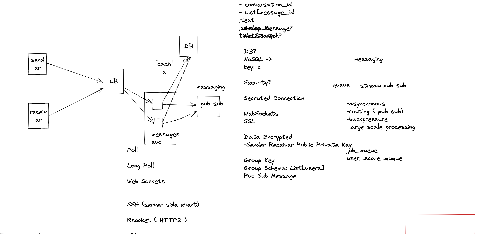

# WhatsApp Design

## Design

## Requirements

- Users should be able to start chats with other users
- User should see a list contacts

Optional:
- Group Chat
- Picture/Video Sharing
- Read/Open Notice

## Requirements:

- 100m users total
- 50m users total
- 20 messages per daily user - total 1000m
- sending images/files?

ohn.stith@easymailer.live

link -> https://sketchboard.me/tDzHOlw4giLJ#/

## DB Schema:

Users
user_id -> Sharded by User id
username
password
contacts -> contact_id_1, contact_id_2

Messages
id 
chat_id -> Shard by chat_id
from_user_id //-> Shard by [from_user_id, to_user_id]
to_user_id
text

Key-Value DB

- Functional requirements
- No Security
- Server side events
- Missed NoSQL
