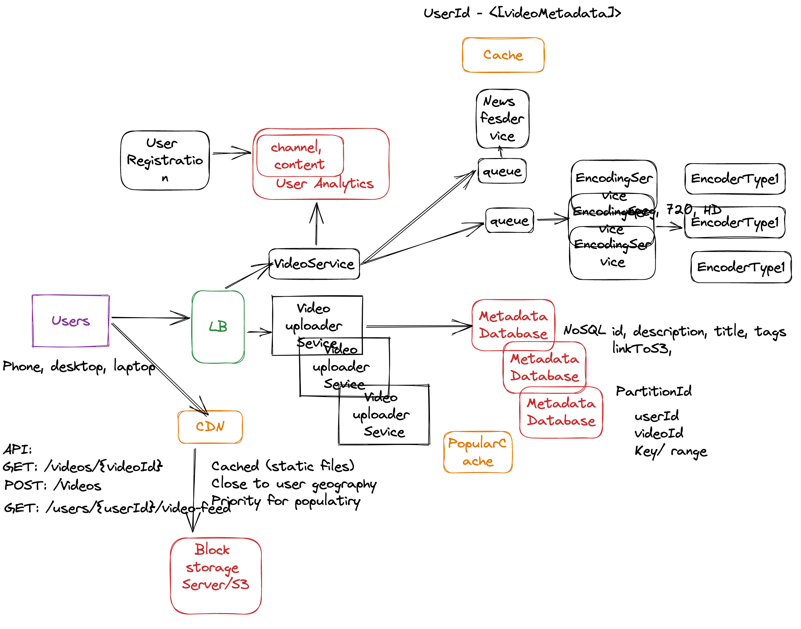

# Youtube Design 

 

## Functional Requirements:

User registration and authentication
Video upload, storage, and playback
Video search and discovery
Video commenting and rating
Channel creation and management
Advertising support
Reporting and analytics

## Non-Functional Requirements:

High availability and scalability to handle millions of users and videos
Low latency for video playback and interactions
High video and audio quality
Security for user data and video content
Support for a wide range of video formats
Compliance with copyright laws

## Features Scope:

User profile and channel customization
Playlists and video recommendations
Subscription and notification features
Video editing and transcoding tools
Live streaming support
Monetization options for creators
Multi-language support
Back of envelope estimation:
A rough estimate for building a basic version of YouTube would be a team of around 20-30 software engineers working for about a year. However, a full-featured version of YouTube would likely require a much larger team and more time.

## Schema Design:
The data model for YouTube would include entities such as users, videos, channels, comments, and ratings. These entities would be related to each other through relationships like uploader, subscriber, and comments.

## API Design:
YouTube's API would offer endpoints for user registration and authentication, video upload, video playback, channel management, and other features. The API would be designed to be RESTful and to return data in JSON format.

## High level Diagram component Design:

The high level architecture of YouTube system would consist of following components:

Frontend: Consists of various web pages, where user interacts with the system.
Backend: Consist of various services like User Service, Video Service, Comment Service, and Advertising Service, etc.
Database: Store all the meta-data and content of the videos.
Caching: used to store frequently access data to improve the read performance.
Content delivery network (CDN): used to distribute the video content to different geographic regions.
Storage: used to store the videos, images, and other static files.
Load balancer: used to distribute the traffic across multiple servers.

## Functional Requirements 

1. User should upload a video 
2. User should access analytics (Views, Likes, Comments) 
3. User should access a feed (based on  recent, followed, recent search, recent watched) 
4. User should update administrative settings (Video settings, Account settings)
5. User should watch videos in different encoding formats 
6. User should follow channels 

## Non-Functional Requirements 

1. Scalability
2. Availability Fault Tolerance
3. Performance
