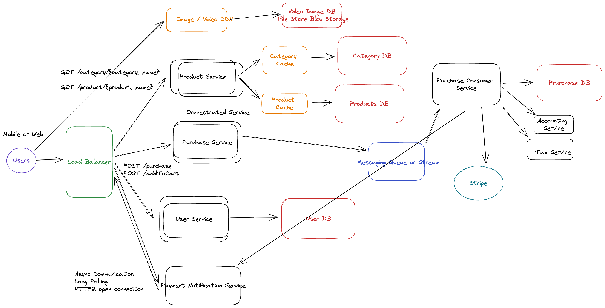

# Design an ecommerce platform



## Requirements

The platform should be similar to Amazon Retail ot  Nike Store

1. A user should be able to purchase products

2. A user should be able to add product to cart

3. A user should see products page

4. A user should see products per category


## Out of scope:
+ Search
+ User account settings
+ Admin Settings (adding products and categories)
+ Product Reviews


### How many users DAU?  50M

### How many users total? 100M total

### How many Purchase per day? 1M


### How many products? 10K products


## Non-Functional Requirements

1. The system should be Scalabe. 50M daily
2. THe system should be available. 99.99%
3. The system should be performant. (10 second purchase, Fast page views)
4. The system should be secure


## API Design

REST API (grpc)


POST /purchase

request:
```json
{
  user_id: 1,
  list_of_products: 
  [{
    product_name:'ball',
    price:64.2,
    SKU: (unique code) IHUDN,
    quatity: 
    ...
  }]
}```

response:
HTTP Code: 201, 200
```json
{
  status: '...'
}
```

GET /product/{product_name}


response:
HTTP Code: 400, 200
```json
{
  {
    product_name:'ball',
    price:64.2,
    SKU: (unique code) IHUDN
    decription: 
    reviews: [...]
    recommended_products: ...
    image_url: 'cnd.image.com/ABCD'
  }
}
```

GET /category/{category_name}


response:
HTTP Code: 400, 200
```json
{
  [{
    product_name:'ball',
    price:64.2,
    SKU: (unique code) IHUDN
    image_url: 'cnd.image.com/ABCD'
  }]
}
```


## Data Design

Category SQL or NoSQL
+ categgory_id *key
+ cateogry_name

Product SQL or NoSQL
+ product_id *key
+ product_name:'ball',
+ price:64.2,
+ SKU: (unique code) IHUDN
+ decription: 
+ recommended_products: ...
+ image_url: 'cnd.image.com/ABCD'


Review SQL or NoSQL
+ review_id
+ product_id
+ review_text
+ review_date


User No SQL (SQL with sharding)
+ user_id (Key) sharding on user_id, sharding on location
+ name
+ CC (encrypted) RSA 
+ CCV (encrypted) RSA 
+ location


Purchase
+ pruchase_id (Key)
+ user_id
+ product_id
+ total_amout
+ date

PCI compliant


## Estimation

100M users
(user table) 10KB

1TB of users


Products LOW 1GB - 100GB


Pruchase 1M * 1KB = 1GB  per day

365 GB per year


QPS - 50M views per day in QPS = 1000 QPS views

1 QPS per second


https://excalidraw.com/#room=ee92dd4502c1f1d9d832,mKYGi13aW0G9liDkmY5CuA


