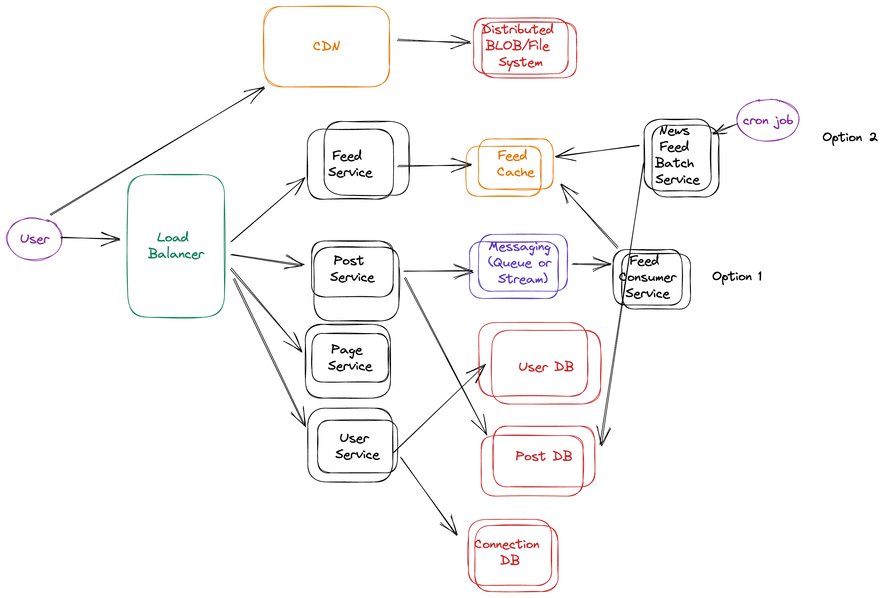

# Facebook System design




## Functional Requirements

1) A user should be able to post 
  1) A user can post a Picture, Video with Text and Hashtag and Location
  2) A user can tag someone in a picture
  3) A user can set the privacy for the post

2) A user should see a news feed 

3) A user can follow Pages and Friend other users

4) A user can access a user Page or Friend Page


5) A user should be able to create an account, login, logout

6) A user can change settings


How many users ?

The system should support 1B total users?
20% of user are daily active users

How often does a user post?
A user posts once a day on average

How many times a user reads the news feed and read other pages?
2 times per day and 50 posts each time


## Non Functional Requirements

1) The system should Scale to 200M users daily
2) The system should have low latency. 200 MS
3) The system should stay available. 99.99%
4) The system should set privacy of account and posts.
5) The system should be consistent in each country.


## API design

Communication: REST or RPC

GET /newsFeed/{date_time}

response:
```json
{
  [{
    post_id : 1,
    type : 'VIDEO' (or 'PICTURE'  ),
    content_url : [ {picture_id: 1, 'https://cdn.fb.com/12343'}]
    text : 'Hello',
    hashtag : ['#good','#day'],
    likes : [happy=2, angry=1],
    comments :[{
      poster_id,
      poster_name,
      comment_text
    }]
  }]
}
```

### POST /post

request:
```json
{
user_id,
content,
}
```
response:
```json
HTTP response 200 post 201 sucess
{
status_message : 'FAIL' or 'SUCCESS'
}
```

### POST /postContent

Body content-type: BLOB


response:
HTTP response 200 post 201 sucesss
```json
{
status: 'FAIL' or 'SUCCESS'
}

```


### POST /follow

Body content-type: json
```json
{
user_id_follower
user_id_follow
}
```

....

response:
HTTP response 200 post 201 sucesss
{
status: 'FAIL' or 'SUCCESS'
}


## Back-of-the-envelope calculations


200M users daily active

200M * 2 * 50 posts = 1B * 20 = 20 B posts seen per day 

Average post = 50 KB

= 100 TB read per day

(posts)


Posting 200M posts per day = 1TB per day posted


QPS read : 200M * 2 = 400M newsfeed read  * 10^-5= 100K per second reads

QPS Write: 50 K per second writes


## Data Design - Cache (for Latency)


### newsFeed
Key * User_id (user reading)

{
  [{
    post_id : 1,
    type : 'VIDEO' (or 'PICTURE'  ),
    content_url : [ {picture_id: 1, 'https://cdn.fb.com/12343'}]
    text : 'Hello',
    hashtag : ['#good','#day'],
    likes : [happy=2, angry=1],
    comments :[{
      poster_id,
      poster_name,
      comment_text
    }]
  }]


Posts No SQL Database (for Latency and availablilty and Scalability)

post_id 
type : 'VIDEO' (or 'PICTURE'  ),
content_url : [ {picture_id: 1, 'https://cdn.fb.com/12343'}]
text : 'Hello',
hashtag : ['#good','#day'],
likes : [happy=2, angry=1],
poster_id,
poster_name,
comment_text

key* location or post_id


User No SQL Database 
user_id
user_name
dob
created_date
...
number_of_friends
...
partition_key: location


Connection No SQL Database 
user_id
followers


https://excalidraw.com/#room=7a84d23502c0446f2d8a,Ah1E7onnZ0comA3vVCC9vg


Instagram vs Facebook Difference 

+Likes
+Groups
+Pages and People (everything is a page)


Optional: 
Look at difference in design Facebook vs Instagram
Advertising system
Recommendation of news Feed
